# 🔬 AML 360º — Advanced Anti-Money Laundering Detection System

<div align="center">

**🏆 Hybrid Architecture: Graph + Sequence + Bayesian + Statistical**

[](https://python.org)
[](src/models/)
[](src/statistics/)
[](src/api/)
[](sql/)

*A scientifically rigorous, production-ready AML system combining cutting-edge machine learning, advanced statistics, and causal inference*

</div>

---

## 🎯 **System Overview**

The AML 360º system represents the pinnacle of anti-money laundering technology, integrating **advanced statistical methods**, **modern machine learning**, and **rigorous scientific validation** to detect financial crimes with unprecedented accuracy and explainability.

### **🔥 Key Differentiators**
- **📊 Advanced Statistics**: EVT, GARCH, WOE/IV, Causal Inference
- **🧠 Hybrid ML**: Graph Neural Networks + Sequential Models + Bayesian Fusion  
- **🔬 Scientific Rigor**: Monte Carlo validation, statistical testing, uncertainty quantification
- **⚡ Production Ready**: Real-time API, monitoring, explainability
- **🏛️ Regulatory Compliant**: Audit-ready documentation and interpretability

---

## 🧮 **Mathematical Foundation**

Our system is built on solid mathematical principles:

```mathematical
Cost Function: J = c_FN × FN + c_FP × FP + c_rev × Review_Time

Bayesian Fusion: P(SAR|x,D) = ∑ P(SAR|x,M_k,D) · P(M_k|D)
                                k=1

EVT Modeling: F_u(x) = 1 - (1 + ξ(x/σ))^(-1/ξ)

ATE Estimation: τ̂_DR = 1/n ∑[μ̂₁(Xᵢ) - μ̂₀(Xᵢ) + Tᵢ(Yᵢ-μ̂₁(Xᵢ))/e(Xᵢ) - (1-Tᵢ)(Yᵢ-μ̂₀(Xᵢ))/(1-e(Xᵢ))]
```

---

## 🏗️ **System Architecture**

```mermaid
graph TB
    subgraph "Data Layer"
        A[Transactions<br/>PIX, Cards, TED] --> B[BigQuery<br/>Data Warehouse]
        C[External Data<br/>PEP, Sanctions] --> B
        D[Behavioral Data<br/>Device, IP, Geo] --> B
    end
    
    subgraph "Feature Engineering"
        B --> E[Statistical Features<br/>EVT, GARCH, WOE/IV]
        B --> F[Graph Features<br/>Centrality, Community]
        B --> G[Sequential Features<br/>Patterns, Burstiness]
        B --> H[Behavioral Features<br/>Velocity, Geo-entropy]
    end
    
    subgraph "ML Models"
        E --> I[Regulatory Scorecard<br/>Logistic + WOE]
        E --> J[Advanced Tabular<br/>LightGBM + Focal Loss]
        F --> K[Graph Neural Network<br/>GraphSAGE + GAT]
        G --> L[Sequential Model<br/>LSTM + Transformers]
        H --> M[Anomaly Detection<br/>Isolation Forest + LOF]
    end
    
    subgraph "Ensemble & Decision"
        I --> N[Bayesian Fusion<br/>MCMC Weighting]
        J --> N
        K --> N
        L --> N
        M --> N
        N --> O[Risk Score<br/>+ Explainability]
    end
    
    subgraph "Production"
        O --> P[FastAPI<br/>Real-time Scoring]
        P --> Q[Monitoring<br/>Drift Detection]
        P --> R[Case Management<br/>Analyst Dashboard]
    end
```



---

## 📊 **Feature Engineering Pipeline**

### **Statistical Methods Implemented**

| Method | Formula | Application |
|--------|---------|-------------|
| **Extreme Value Theory** | $F_u(x) = 1 - (1 + \xi \frac{x}{\sigma})^{-1/\xi}$ | Tail risk analysis |
| **GARCH Volatility** | $\sigma_t^2 = \omega + \alpha \epsilon_{t-1}^2 + \beta \sigma_{t-1}^2$ | Transaction volatility |
| **Weight of Evidence** | $WOE_i = \ln(\frac{G_i/G_T}{B_i/B_T})$ | Feature binning |
| **Fano Factor** | $F = \frac{\text{Var}(N)}{\text{E}[N]}$ | Burstiness detection |
| **PageRank** | $PR(v) = \frac{1-d}{N} + d \sum_{u \in M(v)} \frac{PR(u)}{L(u)}$ | Network importance |

### **Feature Categories**

```sql
-- Advanced Statistical Features (571 lines of SQL)
CREATE OR REPLACE TABLE `aml.ml_features` AS
SELECT 
    -- Behavioral (24h/7d/30d windows)
    tx_count_24h, velocity_ratio_24h_7d, unique_payees_24h,
    
    -- Statistical (EVT, GARCH, Burstiness)  
    evt_p95_threshold, amount_above_evt, fano_factor,
    
    -- Graph (Community, Centrality)
    out_degree, pagerank_proxy, community_bridge,
    
    -- Sequential (Patterns, Structuring)
    potential_smurfing, potential_layering, max_run_length,
    
    -- WOE Encoded  
    woe_amount, woe_volume, woe_diversity,
    
    -- Composite Risk
    composite_risk_score
FROM feature_engineering_pipeline;
```

---

## 📁 **Project Structure**

```
AML 360º/
├── 📚 docs/                           # Scientific Documentation
│   ├── mathematical-foundations.md    # Mathematical foundations
│   ├── technical-architecture.md      # Detailed system design  
│   └── implementation-roadmap.md      # RACI matrix & timeline
│
├── 🔬 src/statistics/                 # Advanced Statistical Framework
│   ├── statistical_tests.py          # Comprehensive statistical testing
│   ├── causal_inference.py           # Propensity scores, ATE estimation
│   └── monte_carlo.py                 # Uncertainty quantification
│
├── 🤖 src/models/                     # ML Model Implementations  
│   └── ensemble.py                   # Hybrid ensemble system
│
├── ⚡ src/api/                        # Production API
│   └── main.py                       # FastAPI with monitoring
│
├── 🔍 src/features/                   # Feature Engineering
│   └── feature_extractor.py          # Statistical features
│
├── 💾 sql/                           # BigQuery Pipeline
│   └── feature_engineering.sql       # Advanced features
│
├── 📊 notebooks/                     # Analysis Notebooks
│   ├── 01_AML_EDA_and_Training.ipynb # Model training & evaluation
│   └── 02_Statistical_Validation.ipynb # Scientific validation
│
├── 🐳 docker/                        # Production Deployment
│   ├── Dockerfile                    # Multi-stage optimized build
│   └── docker-compose.yml            # Full stack with monitoring
│
├── ⚙️ config/                        # System Configuration
│   └── config.yaml                   # Comprehensive settings
│
└── 🚀 setup.py                       # Automated setup & testing
```

---

## 🧠 **Machine Learning Models**

### **1. Regulatory Scorecard (Explainable)**
```python
class RegulatoryScorecardModel:
    """Logistic Regression with WOE encoding - fully explainable"""
    
    def calculate_woe_iv(self, feature, target):
        # WOE = ln(Distribution_Goods / Distribution_Bads)
        # IV = Σ(Dist_Goods - Dist_Bads) × WOE
        return woe_dict, information_value
    
    def get_reason_codes(self, prediction):
        return ["High transaction velocity", "Unusual geographic pattern", ...]
```

### **2. Advanced Tabular Models**
```python
class AdvancedTabularModel:
    """LightGBM with Focal Loss for imbalanced data"""
    
    def focal_loss(self, y_pred, y_true, alpha=0.25, gamma=2.0):
        # FL(p_t) = -α_t(1-p_t)^γ log(p_t)
        p = 1 / (1 + np.exp(-y_pred))
        alpha_t = alpha * y_true + (1 - alpha) * (1 - y_true)  
        pt = p * y_true + (1 - p) * (1 - y_true)
        return alpha_t * (1 - pt) ** gamma * (-np.log(pt + 1e-8))
```

### **3. Bayesian Ensemble Fusion**
```python
class BayesianEnsemble:
    """Probabilistic model combination with uncertainty quantification"""
    
    def fit(self, model_predictions, targets):
        with pm.Model() as fusion_model:
            # Dirichlet prior for model weights
            weights = pm.Dirichlet('weights', a=np.ones(len(models)))
            
            # Weighted combination
            combined_logits = pm.math.dot(predictions, weights)
            
            # MCMC sampling for optimal weights
            trace = pm.sample(2000, tune=1000, chains=2)
```

---

## 🔬 **Scientific Validation Framework**

### **Advanced Statistical Testing**

| Test | Purpose | Implementation |
|------|---------|----------------|
| **Population Stability Index** | Model stability | `statistical_tests.py` |
| **Kolmogorov-Smirnov** | Distribution drift | Bootstrap CI + significance |
| **Jensen-Shannon Divergence** | Feature drift | Monte Carlo validation |
| **Extreme Value Theory** | Tail risk analysis | GPD fitting + goodness-of-fit |
| **GARCH Effects** | Volatility clustering | LM test + parameter estimation |
| **Causal Inference** | Treatment effects | Propensity scores + doubly robust |

### **Performance Targets**
```
📈 MODEL PERFORMANCE TARGETS
=============================
PR-AUC:              Target: >0.75
ROC-AUC:             Target: >0.85 
Recall@20%:          Target: >80%
Precision:           Target: >70%
False Positive Rate: Target: <5%

⚡ SYSTEM PERFORMANCE TARGETS
==============================
API Latency (p95):   Target: <200ms
Throughput:          Target: >5K TPS
Uptime:              Target: >99.9%
```

---

## 🔧 **Quick Start**

### **1. Installation & Setup**
```bash
# Clone and setup
git clone <repository>
cd PROJETCT/
python setup.py  # Automated setup with dependency check
```

### **2. Model Training**
```python
# Start Jupyter environment
jupyter lab

# Open: notebooks/01_AML_EDA_and_Training.ipynb
# This trains the complete ensemble system with scientific validation
```

### **3. Production Deployment**
```bash
# Start complete stack with monitoring
docker-compose -f docker/docker-compose.yml up

# Access points:
# API: http://localhost:8000
# Docs: http://localhost:8000/docs  
# Grafana: http://localhost:3000
```

---

## ⚡ **Production API**

### **Real-time Scoring**
```bash
curl -X POST "http://localhost:8000/score" \
  -H "Content-Type: application/json" \
  -d '{
    "transaction_id": "tx_123456",
    "payer_id": "user_789", 
    "amount": 9950.00,
    "timestamp": "2024-01-15T14:30:00Z",
    "channel": "PIX"
  }'
```

**Response Schema:**
```json
{
  "risk_score": "float (0-1)",
  "risk_level": "string (LOW/MEDIUM/HIGH)", 
  "confidence": "float (0-1)",
  "reason_codes": [
    {
      "feature": "string",
      "contribution": "float",
      "description": "string"
    }
  ],
  "processing_time_ms": "integer"
}
```

---

<div align="center">

## 🚀 **Ready to Transform AML Operations?**

**Experience the power of scientifically-proven technology**

```bash
python setup.py && echo "🎉 Welcome to the future of AML detection!"
```


</div>
